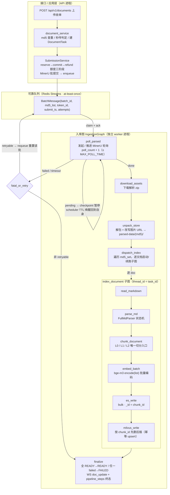
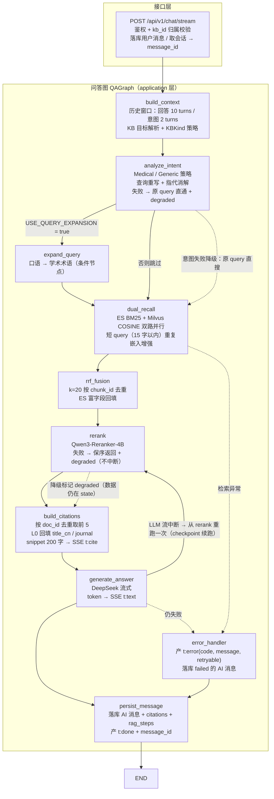
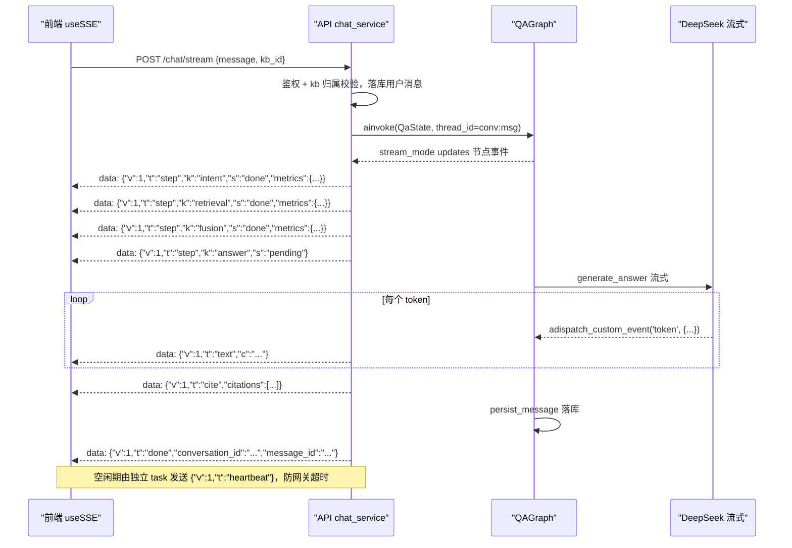

# LangGraph 双图设计（Mermaid）

> 与 `总需求文档.md` §6.2 / §6.3 对应。GitHub、VS Code（Mermaid Preview）、Typora 均可直接渲染 ```mermaid 块。

---

## 1. 入库图 IngestionGraph

**线程**：`thread_id = batch_id`（批图）/ `task_id`（`index_document` 子图）
**checkpoint**：`langgraph-checkpoint-postgres`，每节点边界写 `pipeline_steps`（图是唯一写入方）
**红线**：compile 必挂 checkpointer；RetryPolicy 显式 `retry_on`；poll 用 `poll_count` 状态机走条件边（LangGraph 无原生 sleep）



### 节点与条件边说明

| 节点 / 边 | 说明 |
| --- | --- |
| `poll_parsed` | 发起/推进 MinerU `extract-results` 轮询；`pending` 时经 checkpoint 暂停，由外部 scheduler 定时唤醒 resume（**不做节点内 while**）；`poll_count` 受 `MAX_POLL_TIME` 上限，配 `RecursionLimit` 防自环失控 |
| `fatal_or_retry` 条件边 | 依据错误类型分流：`Transient`（可重试）→ requeue 回队列重置该批；`Fatal` / 超时 → finalize 置 FAILED |
| `index_document` 子图 | 批内逐 doc 串行；子图内任一步抛 `Transient` → 节点级 `max_retries` 自环重试（显式 `retry_on`）；抛 `Fatal` → 短路 finalize |
| `es_write` / `milvus_write` | `_id` / 主键统一 `chunk_id`，重入幂等；Milvus 先删后插 |
| `finalize` | 汇总批结果：全部 READY → `status=READY`；任一失败 → `FAILED` + 事件总线广播 doc_update |

---

## 2. 问答图 QAGraph

**线程**：`thread_id = conversation_id:message_id`
**checkpoint**：节点边界落库（方案①）；token 级流式内容**不进 state**，避免高频序列化
**流式**：`stream_mode=['updates','values']` 产 `t:step`；`astream_events(v2)` + `adispatch_custom_event('token')` 产 `t:text`；心跳帧由独立 asyncio task 定时写队列



### 节点与条件边说明

| 节点 / 边 | 说明 |
| --- | --- |
| `build_context` | 提取历史窗口（回答取最近 10 turns、意图取 2 turns），解析 KB 目标（es_index / milvus_collection / kb_kind） |
| `analyze_intent` | 按 `KBKind` 选 Medical / Generic 策略；重写 + 指代消解；失败降级为原 query 且 `metrics.intent.degraded = true` |
| `expand_query` | 仅 `USE_QUERY_EXPANSION` 且命中转换规则时执行（条件边） |
| `dual_recall` | `embed_query` 为并行前驱；ES bool（must content + should title_cn/keywords boost） + Milvus COSINE(nprobe=16)；初召各 topK=200 |
| `rrf_fusion` | RRF k=20 按 chunk_id 去重，回填 ES 富字段 → `SearchHit` 列表 |
| `rerank` | 失败返回原序并记 `metrics.rerank.degraded=true`（**不静默、不中断流**） |
| `build_citations` | 按 doc_id 去重取前 5，L0 回填标题/刊名，snippet 200 字 → 产 `t:cite` |
| `generate_answer` | DeepSeek 流式；token 经 `on_token` 回调泵入 asyncio.Queue → SSE `t:text`（沿用 ≥20 字符/标点拼批启发式） |
| `persist_message` | 落库 AI 消息 + citations + rag_steps，更新会话 updated_at；产 `t:done` 携带 message_id 供前端幂等 |
| `error_handler` | 任意节点致命异常 → 产 `t:error{code, message, retryable}` + 落库 failed 标记；**错误不再拼进正文** |

---

## 3. SSE 事件流映射（QAGraph 运行期）



### 双通道说明

| 通道 | 用途 | 实现 |
| --- | --- | --- |
| 节点级 `t:step` | 管线进度 + metrics | `graph.stream(stream_mode=['updates','values'])` |
| token 级 `t:text` | 回答流式 | `astream_events(version='v2')` + 节点内 `adispatch_custom_event('token')` → 消费端 `on_custom_event` |
| `t:heartbeat` | 防网关掐断 | 独立 asyncio task 定时写队列，**不放图内** |

> 注：不要在同一个循环里混用 `astream` 与 `astream_events`；节点事件与 token 流分两个通道。
